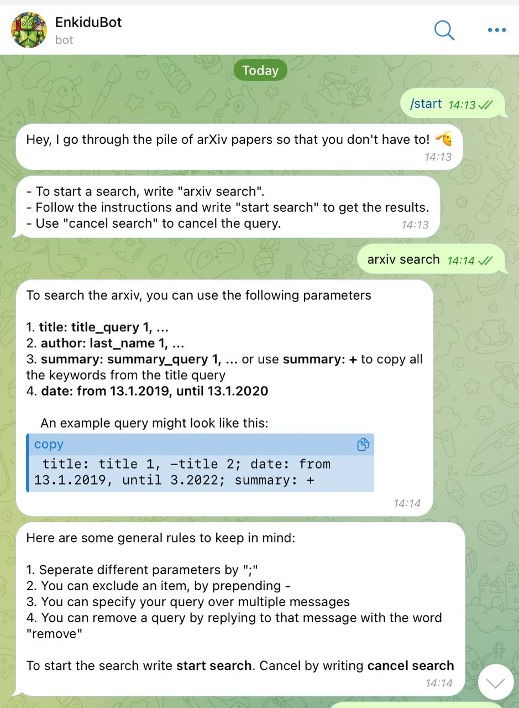
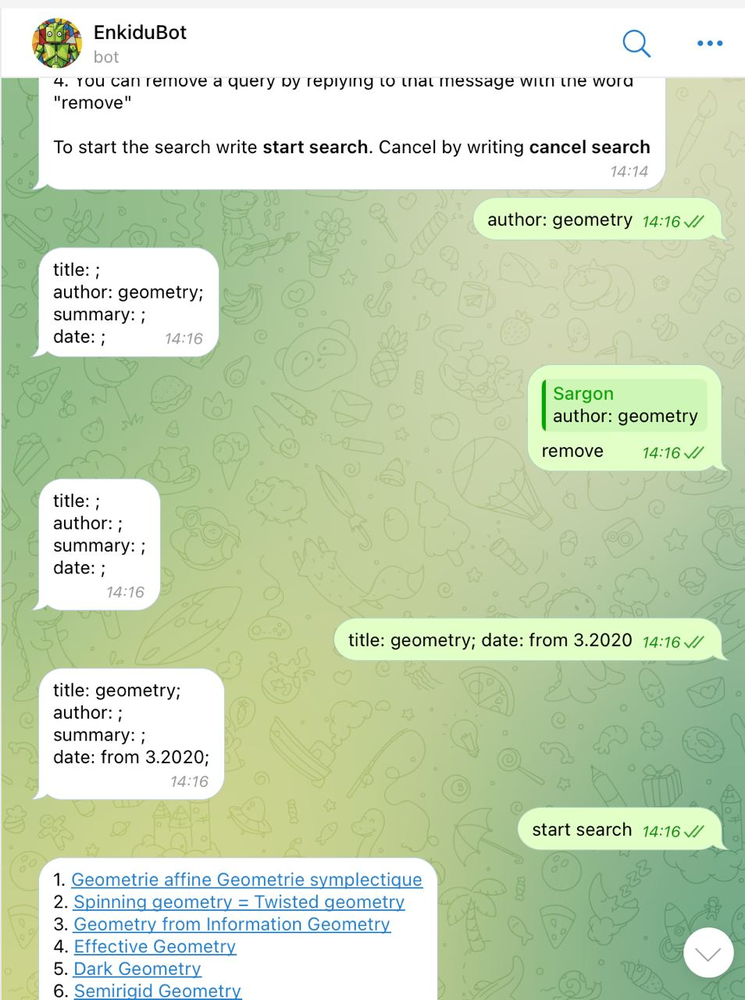

# EnkiduBot

A telegram bot that searches the arXiv for papers using the [arXiv API](https://info.arxiv.org/help/api/index.html).

## About 

Right now you can search the arXiv for papers based on
- author
- title
- publication date
- summary

More details are provided by the bot.

More features in progress.

⚠️ Warning: This bot uses the arXiv API, which at times can be unstable. See for example [here](https://groups.google.com/g/arxiv-api/c/DYHxWrtBgbo/m/k1cbbM0IBwAJ). This means sometimes you might just get no results, although there are some.  

## Example
 

## Usage

Fill in your bot token
```
token = 'BOT_TOKEN_HERE'
```
Then you can run it locally
```
npx tsc
node bot.js
```


